# Imbalanced Learning

## Introduction

Imbalance is a very common issue in classification problems. It is inherent to some areas like anomaly detection, diagnosis, spam detection or insurance claims among others. The issue in the imbalanced case is that most classification algorithms are doing maximization of the accuracy or a similar measure and if the ratio of the data is 99:1, it will very certainly only predict the majority class and shows an accuracy of 99%, whereas the algorithm is not doing anything at all. First, it is necessary to use a different metric adapted to this kind of problem like the f1-score or the AUC or the area below the ROC (Receiving Operator Characteristic) curve.
The f1-score is:

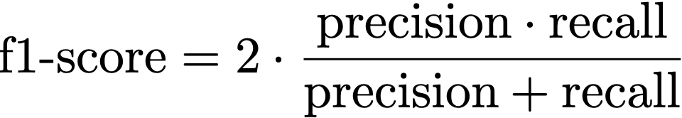

with

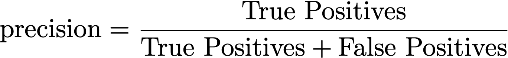

and

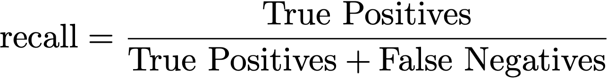

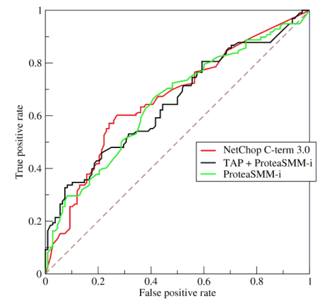

The AUC is the area below the colored curves.

There are some algorithms that naturally deal well with imbalanced datasets like methods based on trees. It is also possible to use cost-sensitive algorithms to put more weights on the minority class for example.

A different approach is to use resampling methods that aim to artificially get a balanced dataset. There are several ways to do that, it is possible to remove observations from the majority class (undersampling), to replicate or to create observations of the minority class (oversampling) or to do a combination of both.

## Datasets chosen

### Links to the datasets

#### Credit Card Fraud

https://www.kaggle.com/mlg-ulb/creditcardfraud

#### Wine Quality

https://www.kaggle.com/rajyellow46/wine-quality?select=winequalityN.csv

#### Insurance Claims

https://www.kaggle.com/arashnic/imbalanced-data-practice

### Credit Card
We have a dataset about credit card frauds with the data of 284797 individuals. There are only 482 frauds in this dataset, so the ration is close to 600:1. It is a binary problem where we have to find abnormal variables.
Insurance claims
The goal with this dataset is to predict whether a client would be interested in vehicle insurance. It is a binary classification problem. We have information about demographics (gender, age, region code type), vehicles (Vehicle Age, Damage) and policy (Premium, sourcing channel) etc. The ratio is close to 5:1.

| Insurance Claim |interested | not interested |
|----------- | --------|------ |
|Number of individuals| 62531 | 319594 |

### Wine quality

The third dataset is about wine quality. We have to do a multi-classification task as we have 6 possible classes distributed as below.

|Wine Quality | 3 | 4 | 5 | 6 | 7 | 8 | 9 |
|------------ |-- |-- |---|---|---|---|---|
| Number of observations | 30 | 216 | 2138 | 2836 | 1079 | 193 |5 |

## Methods to deal with imbalance dataset

The simplest way to do resampling is to do random resampling but in case of undersampling, it leads to a loss of information which can be even more annoying than the imbalance itself. 

### Tomek Links

However there exists more sophisticated methods to lower the defaults of this method. A famous undersampling method is Tomek Links.
It consists in creating pairs of points with each pair containing a point from the minority class and a point from the majority class. Then, we simply remove the points of the majority class on some pairs to reach the ratio we want. It gives a cleaner separation between the two classes and hopefully better results.

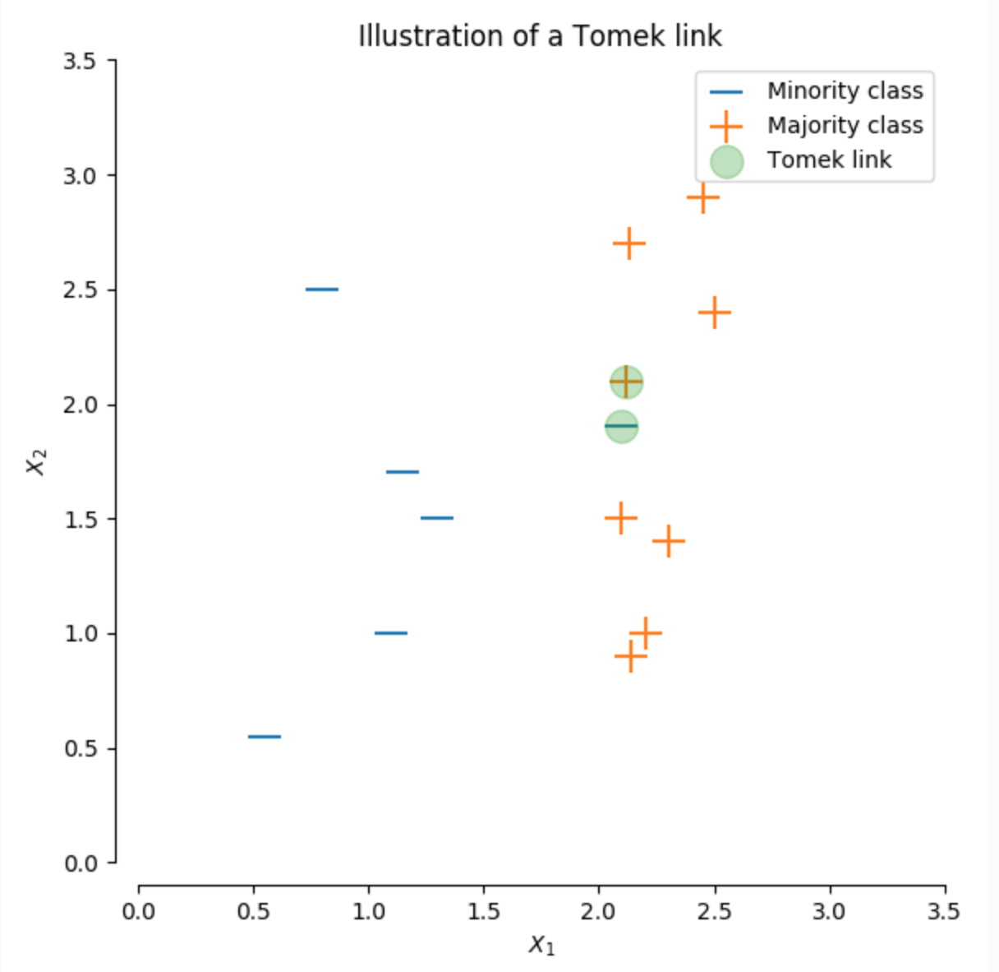

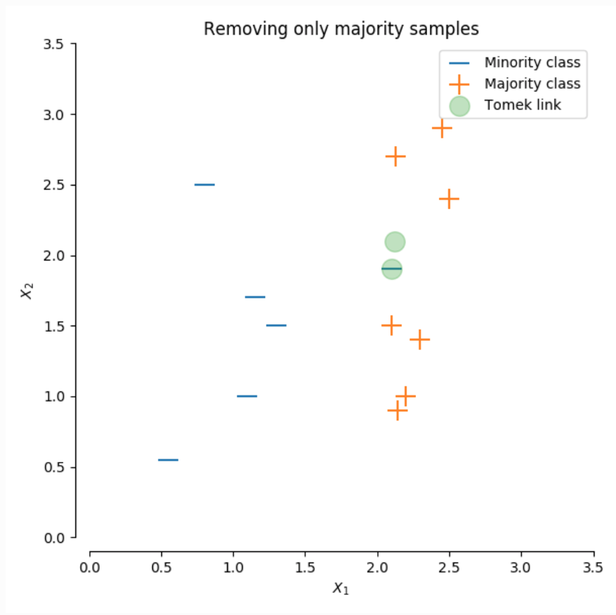

Illustration of the undersampling process in the Tomek Links algorithms

### Cluster Centroids

Another way to do undersampling is to compute the centroids of the points in the majority class 
and to replace these points by their centroids. It is a way to lose less information since we are 
‘synthesizing’ the information contained in the majority class. 

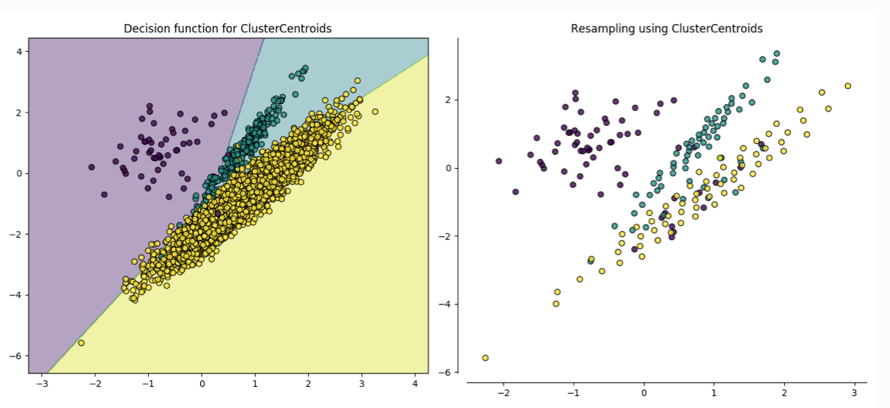

Illustration of the undersampling process in the Cluster Centroids algorithm

### Cost-sensitive SVM

The Support Vector Machine algorithm looks for an hyperplane which leads to the best separation between the classes. Without adjustments SVM are not very effective in the imbalanced case, but when the errors in the majority class are weighted more heavily we can get very satisfying results.
The SVM minimizes the risk of the hinge loss

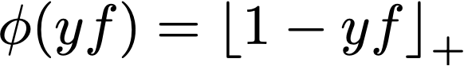

In the cost-sensitive case, it leads to the following cost-sensitive loss function.

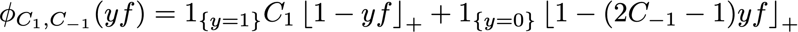

We can adjust the value of C(i). With the function above, the bigger C(1), the bigger the weight for misclassified 1 and  the bigger C(-1), the bigger the weight for misclassified -1.

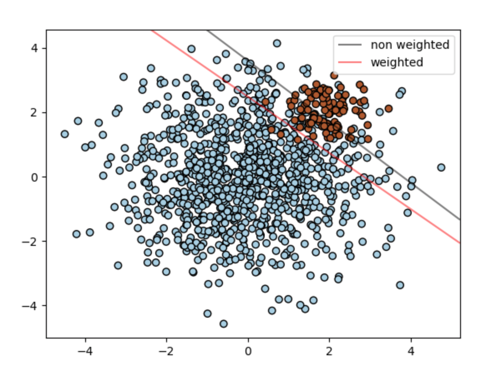

Illustration of the weighted SVM versus non weighted SVM

The decision trees or random forest algorithms often perform well on an imbalanced dataset due to the splitting rule that can force both classes to be addressed. But it is also possible to use cost-sensitive decision trees to reach better results.

### Oversampling  

Oversampling is a method which consists in duplicating observations that are in the minority class. It can be done in 2 ways:  

- Either we duplicate them untill we obtain the same number of observations in the majority class and in the minority class  
- Either we duplicate them untill we reach a wanted ratio (for example, a case where we would like 500 observations of the minority class for 1000 observations in the majority class)  

We will see in our project that the oversampling strategy is important and can leads to really different results.  

The main issue that we have to care about when we want to combine oversampling and cross validation, is to not oversample before getting the cross validation splits. Indeed, by doing so, we would duplicate minority class observations on the test set. Thus we would get some good results, but biased.  

### SMOTE  

Oversampling strategies presented above are performing well most of the time. However, duplicating examples do not bring any information. It only gives more weight to minority class observations which can sometimes leads to overfitting.  
__Synthetic Minority Oversampling Technique__ is a method which consits in "creating" new observations on the basis of the observed ones. It basically get examples of the minority class that are close in the same feature space, draw a line between them and create new observations from points that are on this line.  

## Results obtained with each method on each dataset

### For oversampling strategies  

On the part of oversampling strategies, we have decided to perform cross validation on 5 train and test set that we have constructed by hand. Indeed, we wanted to have in each test set, the same proportion of observations of the minority class (i.e. 20%). We have chosen this way to evaluate our model because usual cross validation chooses at random observations (independantly of their class) to be in the test set, and so we could have some test sets with only majority class observations for example. 

#### Using only basic oversampling  

On all the following, we will use at first a _RandomForestClassifier_ to see how our model perform according to oversampling strategy that we choose. Indeed, we are first more interested in the evolution of the f1_score on cross validation according to parameters of oversampling than the classifier itself. 

- __Credit card dataset__

First, we get the 5 train and test set on which we will perform cross validation. Then we decide to run our model (_RandomForestClassifier_) on the data without using overampling to see what are the scores. This will be our basis to compare our other method with oversampling. Indeed, we want some better results than this one.  
To perform oversampling, we decide to use the _minority_ argument of the function _RandomOverSample()_. This parameter duplicates observations of the minority class untill we obtain the same number of observation in each class. Note that we only duplicate observations of the train set and not of the test set. 

### For undersampling strategies

#### Credit Card Dataset

| F1-score             | Logistic Regression | Decision Trees | Naive Bayes | KNN | Random Forest Classifier |
|-                     |-                    |-               |-            |-    |--------------------------|
| Normal               | 0.83 | 0.88 | 0.63 | 0.60 | 0.92 |
| Random undersampling |0.54  |0.49  | 0.60 |    - | 0.57 |
| Cluster Centroids    |0.46  |-     |-     |  -   | 0.17 |
| Tomek Links          |0.46  |0.87  | 0.63 | -    | 0.92 |
| Near Miss 1          |-     |-     |-     | -    | 0.32 |
| Near Miss 3          |-     |-     |-     | -    | 0.57 |

### For cost-sensitive SVM

| F1-score | Normal | Weighted 1:10 | Weighted 1:50 |
|----------|--------|---------------|---------------|
|          |0.50|0.77|0.80|

#### Wine Quality Dataset

With this dataset we are in a case of multiclassification , so a more adapted metric is the accuracy, that simply measure the proportion of good classification.

###### Classic Methods

|              | Logistic Regression | Decision Trees | GaussianNB | SVC | Random Forest Classifier |
|-             |-                    |-               |-            |-    |--------------------------|
| accuracy     | 0.5382 | 0.5583 | 0.2815 | 0.5313 | 0.668 |

###### Ensemble Methods 

||AdaBoost Classifier | Gradient Boosting Classifier | Bagging Classifier |
|-|----|------|------|
|accuracy| 0.4416            |     0.5761          |  0.6427            |

After A randomized Grid Search Cross Validation with the two models that yield good results

|  |Random Forest Classifier | Bagging Classifier |
|-|----|------|
|accuracy| 0.675 | 0.65 |

#### Insurance Claims Dataset

| F1-score              | Random Forest Classifier |
|-----------------------|--------------------------|
| Normal                | 0.68  |
| Random undersampling  | 0.68  |
| Tomek Links           | 0.71  |
| Near Miss 1           | 0.63  |
| Near Miss 3           | 0.63  |

Confusion matrix without resampling

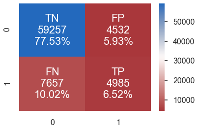

Confusion matrix with Tomek Links

Confusion matrix with Near Miss 1

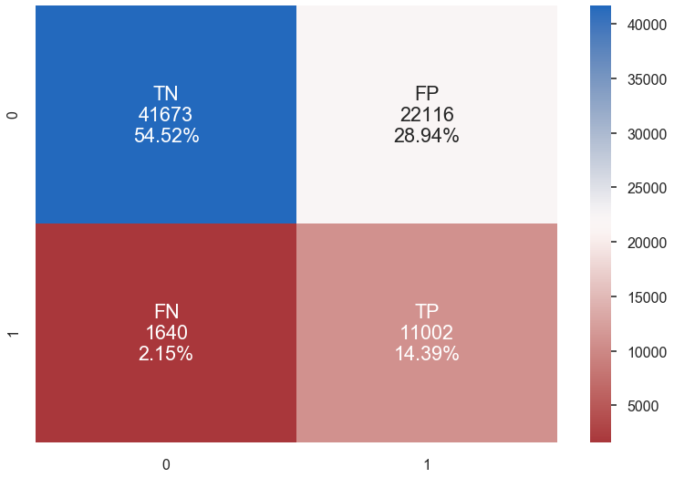

Confusion matrix with Near Miss 3

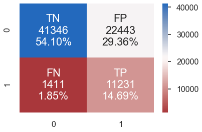

Confusion matrix with Random Undersampling

We can see that with NM1 and NM3 even though the f1-score is worse than without resampling, we are predicting a lot better the True Positives. These methods are efficient. Tomek links and Random undersampling improve also the precision but less than NM algorithm.

## Conclusion

## Bibliography

1. https://imbalanced-learn.readthedocs.io/en/stable/auto_examples/under-sampling/plot_illustration_tomek_links.html#sphx-glr-auto-examples-under-sampling-plot-illustration-tomek-links-py

2. https://www.kaggle.com/rafjaa/resampling-strategies-for-imbalanced-datasets

3. https://imbalanced-learn.readthedocs.io/en/stable/auto_examples/under-sampling/plot_comparison_under_sampling.html#sphx-glr-auto-examples-under-sampling-plot-comparison-under-sampling-py

3. https://machinelearningmastery.com/cost-sensitive-svm-for-imbalanced-classification/
https://arxiv.org/pdf/1212.0975.pdf

4. Masnadi-Shirazi, Vasconcelos and Iranmehr, Cost-sensitive Support Vector Machines, Journal of Machine Learning Research (2015)

5. Krawczyk, B., Woźniak, M., Schaefer, G.: Cost-sensitive decision tree ensembles for effective imbalanced classification. Appl. Soft Comput. 14, 554–562 (2014)
