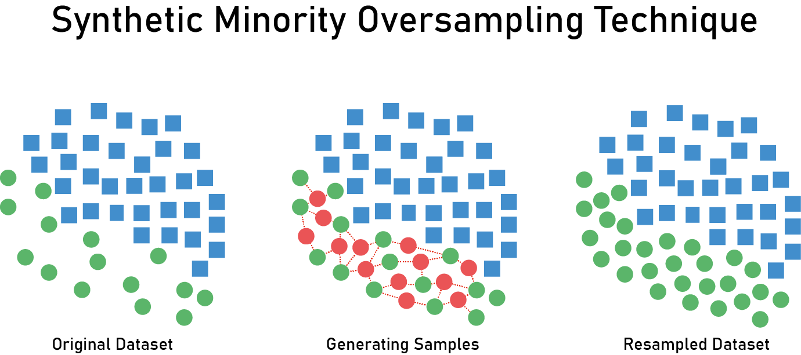

# Imbalanced Learning

## Introduction

Imbalance is a very common issue in classification problems. It is inherent to some areas like anomaly detection, diagnosis, spam detection or insurance claims among others. The issue in the imbalanced case is that most classification algorithms are doing maximization of the accuracy or a similar measure and if the ratio of the data is 99:1, it will very certainly only predict the majority class and shows an accuracy of 99%, whereas the algorithm is not doing anything at all. First, it is necessary to use a different metric adapted to this kind of problem like the f1-score or the AUC or the area below the ROC (Receiving Operator Characteristic) curve.
The f1-score is:

with

and

The AUC is the area below the colored curves.

There are some algorithms that naturally deal well with imbalanced datasets like methods based on trees. It is also possible to use cost-sensitive algorithms to put more weights on the minority class for example.

A different approach is to use resampling methods that aim to artificially get a balanced dataset. There are several ways to do that, it is possible to remove observations from the majority class (undersampling), to replicate or to create observations of the minority class (oversampling) or to do a combination of both.

## Datasets chosen

### Links to the datasets

#### Credit Card Fraud

https://www.kaggle.com/mlg-ulb/creditcardfraud

#### Wine Quality

https://www.kaggle.com/rajyellow46/wine-quality?select=winequalityN.csv

#### Insurance Claims

https://www.kaggle.com/arashnic/imbalanced-data-practice

### Credit Card
We have a dataset about credit card frauds with the data of 284797 individuals. There are only 482 frauds in this dataset, so the ration is close to 600:1. It is a binary problem where we have to find abnormal variables.

### Insurance claims
The goal with this dataset is to predict whether a client would be interested in vehicle insurance. It is a binary classification problem. We have information about demographics (gender, age, region code type), vehicles (Vehicle Age, Damage) and policy (Premium, sourcing channel) etc. The ratio is close to 5:1.

| Insurance Claim |interested | not interested |
|----------- | --------|------ |
|Number of individuals| 62531 | 319594 |

### Wine quality

The third dataset is about wine quality. We have to do a multi-classification task as we have 7 possible classes distributed as below.

|Wine Quality | 3 | 4 | 5 | 6 | 7 | 8 | 9 |
|------------ |-- |-- |---|---|---|---|---|
| Number of observations | 30 | 216 | 2138 | 2836 | 1079 | 193 |5 |

## Methods to deal with imbalance dataset

The simplest way to do resampling is to do random resampling but in case of undersampling, it leads to a loss of information which can be even more annoying than the imbalance itself. 

### Tomek Links

However there exists more sophisticated methods to lower the defaults of this method. A famous undersampling method is Tomek Links.
It consists in creating pairs of points with each pair containing a point from the minority class and a point from the majority class. Then, we simply remove the points of the majority class on some pairs to reach the ratio we want. It gives a cleaner separation between the two classes and hopefully better results.

Illustration of the undersampling process in the Tomek Links algorithms

### Cluster Centroids

Another way to do undersampling is to compute the centroids of the points in the majority class 
and to replace these points by their centroids. It is a way to lose less information since we are 
‘synthesizing’ the information contained in the majority class. 

Illustration of the undersampling process in the Cluster Centroids algorithm

### Near Miss algorithm

Near Miss are undersampling methods that select examples based on the distance between majority class examples and minority class examples. NearMiss-1 selects points from the majority class that have the smallest average distance to the three closest points from the minority class. NearMiss-2 selects points from the majority class that have the smallest average distance to the three furthest points from the minority class. NearMiss-3 involves selecting a given number of majority class points for each point in the minority class that are closest.

### Cost-sensitive SVM

The Support Vector Machine algorithm looks for an hyperplane which leads to the best separation between the classes. Without adjustments SVM are not very effective in the imbalanced case, but when the errors in the majority class are weighted more heavily we can get very satisfying results.
The SVM minimizes the risk of the hinge loss

In the cost-sensitive case, it leads to the following cost-sensitive loss function.

We can adjust the value of C(i). With the function above, the bigger C(1), the bigger the weight for misclassified 1 and  the bigger C(-1), the bigger the weight for misclassified -1.

Illustration of the weighted SVM versus non weighted SVM

The decision trees or random forest algorithms often perform well on an imbalanced dataset due to the splitting rule that can force both classes to be addressed. But it is also possible to use cost-sensitive decision trees to reach better results.

### Oversampling  

Oversampling is a method which consists in duplicating observations that are in the minority class. It can be done in 2 ways:  

- Either we duplicate them untill we obtain the same number of observations in the majority class and in the minority class  
- Either we duplicate them untill we reach a wanted ratio (for example, a case where we would like 500 observations of the minority class for 1000 observations in the majority class)  

We will see in our project that the oversampling strategy is important and can leads to really different results.  

The main issue that we have to care about when we want to combine oversampling and cross validation, is to not oversample before getting the cross validation splits. Indeed, by doing so, we would duplicate minority class observations on the test set. Thus we would get some good results, but biased.  

### SMOTE  

Oversampling strategies presented above are performing well most of the time. However, duplicating examples do not bring any information. It only gives more weight to minority class observations which can sometimes leads to overfitting.  
__Synthetic Minority Oversampling Technique__ is a method which consits in "creating" new observations on the basis of the observed ones. It basically get examples of the minority class that are close in the same feature space, draw a line between them and create new observations from points that are on this line.  

## Results obtained with each method on each dataset

### For oversampling strategies  

On the part of oversampling strategies, we have decided to perform cross validation on 5 train and test set that we have constructed by hand. Indeed, we wanted to have in each test set, the same proportion of observations of the minority class (i.e. 20%). We have chosen this way to evaluate our model because usual cross validation chooses at random observations (independantly of their class) to be in the test set, and so we could have some test sets with only majority class observations for example. 

#### Using only basic oversampling  

On all the following, we will use a _RandomForestClassifier_ to see how our model perform according to oversampling strategy that we choose. Indeed, we are first more interested in the evolution of the f1_score on cross validation according to parameters of oversampling than the classifier itself. We did not try to tune parameters of the classifiers and arbitrarily chose some limiting parameters (as max_depth for the trees) in order to have a fast computational time since cross validation with different strategies is time consuming.  

- __Credit card dataset__

First, we get the 5 train and test set on which we will perform cross validation. Then we decide to run our model (_RandomForestClassifier_) on the data without using overampling to see what are the scores. This will be our basis to compare our other method with oversampling. Indeed, we want some better results than this one.  
To perform oversampling, we decide to use the _minority_ argument of the function _RandomOverSample()_. This parameter duplicates observations of the minority class untill we obtain the same number of observation in each class. Note that we only duplicate observations of the train set and not of the test set. 
Results presented below, correspond to the mean scores of our 5 splits. 

| Oversampling strategy | F1 score | Precision | Recall |
|-                      |-         |-          |-       |
| No oversampling       | 0.6746   | 0.8614    | 0.5549 |
| Minority criterion    | 0.4978   | 0.3529    | 0.8489 |
| Ratio = 0.5           | 0.7445   | 0.6713    | 0.8384 |  
| Ratio = 0.33          | 0.7894   | 0.7567    | 0.8281 |
| Ratio = 0.15          | 0.8136   | 0.8225    | 0.8077 |
| Ratio = 0.11          | 0.8113   | 0.8345    | 0.7912 |
| Ratio = 0.08          | 0.8091   | 0.8490    | 0.7753 |

It is a bit surprising that we obtain some better results without oversampling than with the _minority_ criterion. Without oversampling, we have a high precision, which means that among observations predicted as class 1, we did not make a lot of misstakes. However we have a bad recall which implies that we have predicted only 55% of the minority class observations.  
By fixing the _minority_ criterion, we observe the extreme opposite. We have well predicted 85% of the minority class observations but it is because we have predicted too many class 1 as we can see on the bad recall. This is due to the fact that too much weight is given to duplicated observations (as there are many of them).  
Then for the different ratios, we achieve the best f1 score with a ratio of 15% (which means 15 observations of class 1 for 100 observations of class 0). We also observe that f1 score decreases after 15%.
We can conclude that for this dataset with this classifier, the best oversampling strategy is to choose a ratio of __15%__.

- __Insurance dataset__

Here we implement the same methods but note that we are not going under 33% because the ratio of class 1 compared to class 0 is 20% in the original dataset. 

| Oversampling strategy | F1 score | Precision | Recall |
|-                      |-         |-          |-       |
| No oversampling       | 0.4452   | 0.5076    | 0.3964 |
| Minority criterion    | 0.5258   | 0.4882    | 0.5697 |
| Ratio = 0.5           | 0.5221   | 0.4946    | 0.5309 |  
| Ratio = 0.33          | 0.4892   | 0.4989    | 0.5000 |

We can see that our model is performing worse on this dataset than on the previous one. However we can observe some improvement in the different scores according to the oversampling strategy. The best strategy with this classifier is thus with the _minority_ criterion. 

#### With SMOTE  

As before, we implement some oversampling strategies but using SMOTE this time. First we use SMOTE only with no parameter which, by default use the _minority_ criterion. Then, since documentation on SMOTE advises to combine SMOTE and __undersampling__, we perform it with different parameters. When setting a float parameter in SMOTE, it acts like in the oversampling function, i.e. creating new observation untill we reach the wanted ratio.
On the table below, you can find these strategies and the results obtained where rows combining SMOTE and undersampling are of the form: SMOTE=parameter_smote Under=parameter_undersampling. 

- __Credit card dataset__

| Strategy             | F1 score | Precision | Recall |
|-                     |-         |-          |-       |
| SMOTE only           | 0.7845   | 0.7454    | 0.8302 |
| SMOTE=0.1 Under=0.5  | 0.7339   | 0.6548    | 0.8365 |
| SMOTE=0.2 Under=0.3  | 0.8081   | 0.8052    | 0.8138 |  
| SMOTE=0.2 Under=0.2  | 0.8101   | 0.8070    | 0.8159 |
| SMOTE=0.18 Under=0.19| 0.8085   | 0.8077    | 0.8117 |

Results obtained on this dataset are interesting. However the best f1 score is not higher than the best f1 score of basic oversampling strategies. We could probably gain a bit of performance by combining other parameters, but result obtained with the strategy SMOTE=0.2 and Undersampling=0.2 seems to be quite good.  

- __Insurance dataset__

We do the same for the insurance dataset and have the following results:

| Strategy             | F1 score | Precision | Recall |
|-                     |-         |-          |-       |
| SMOTE only           | 0.4867   | 0.3420    | 0.8466 |
| SMOTE=0.1 Under=0.5  | 0.7379   | 0.6608    | 0.8384 |
| SMOTE=0.2 Under=0.3  | 0.7936   | 0.7664    | 0.8263 |  
| SMOTE=0.2 Under=0.2  | 0.8074   | 0.7664    | 0.8138 |
| SMOTE=0.18 Under=0.19| 0.8118   | 0.8104    | 0.8159 |

Here we can see that compared to basic oversampling strategies, we obtain some really good results. Indeed, when with basic oversampling the highest f1 score was 0.5258, here we obtain a f1 score of 0.8118 with the following strategy: SMOTE=0.18 and Undersampling=0.19. This is a really great improvement that illustrates the power of SMOTE.  

In conclusion, SMOTE seems to work well on dataset for which basic oversampling strategies have failed. However we still obtain good results on dataset where oversampling strategies were already efficient. 

### For undersampling strategies

In this part the f1-score refers to the macro average f1-score which is obtained with the function classification_report of the scikit-learn package. It is the unweighted average of the f1-score obtained for each label.

#### Credit Card Dataset

| F1-score             | Logistic Regression | Decision Trees | Naive Bayes | KNN | Random Forest Classifier |
|-                     |-                    |-               |-            |-    |--------------------------|
| Normal               | 0.83 | 0.88 | 0.63 | 0.60 | 0.92 |
| Random undersampling |0.54  |0.49  | 0.60 |    - | 0.57 |
| Cluster Centroids    |0.46  |-     |-     |  -   | 0.17 |
| Tomek Links          |0.46  |0.87  | 0.63 | -    | 0.92 |
| Near Miss 1          |-     |-     |-     | -    | 0.32 |
| Near Miss 3          |-     |-     |-     | -    | 0.57 |

It seems that the random forest classifier is by far the most adapted model to deal with this dataset. Overall, the undersampling doesn't improve the f1-score. But let's take a closer look to the results with the confusion matrix.

##### Confusion matrix with the Random Forest Classifier

Confusion matrix without resampling

Confusion matrix with Tomek Links

Confusion matrix with Near Miss 1

Confusion matrix with Near Miss 3

Confusion matrix with Random Undersampling

These confusion matrix show us that even though the Tomek Links method gives a good f1-score, it does not improve much the classification on the minority class, whereas the Near Miss version 1 and 3 are improving a bit the proportion of True Positives.

### For cost-sensitive SVM

| -        | Normal | Weighted 1:10 | Weighted 1:50 |
|----------|--------|---------------|---------------|
|  F1-score |0.50|0.77|0.80|

The cost-sensitive SVM also yield good results. The results are better as we increase the weight on the minority class but it takes a lot of time. That's why we stop at the ratio 1:50

#### Wine Quality Dataset

With this dataset we are in a case of multiclassification , so a more adapted metric is the accuracy, that simply measure the proportion of good classification.

###### Classic Methods

|              | Logistic Regression | Decision Trees | GaussianNB | SVC | Random Forest Classifier |
|-             |-                    |-               |-           |-    |--------------------------|
| accuracy     | 0.5382 | 0.5583 | 0.2815 | 0.5313 | 0.668 |

As expected, the Random Forest Classifier yields the best results. Almost 67% of accuracy on this dataset with 6 classes is rather good. A way to improve the classification would be to reduce the number of classes. For instance we can create 3 classes instead of 7 with first class : poor quality (3 and 4) ; second class : average quality (4, 5 and 6) and third class : excellent quality (7 and 8). But this would simplify to much this classification task and this is not the point of this project.

###### Ensemble Methods 

We also tried with ensemble methods that are well-known to give good results.

||AdaBoost Classifier | Gradient Boosting Classifier | Bagging Classifier |
|-|----|------|------|
|accuracy| 0.4416            |     0.5761          |  0.6427            |

After A randomized Grid Search Cross Validation with the two models that yield good results

|  |Random Forest Classifier | Bagging Classifier |
|-|----|------|
|accuracy| 0.675 | 0.65 |

#### Insurance Claims Dataset

| F1-score              | Random Forest Classifier |
|-----------------------|--------------------------|
| Normal                | 0.68  |
| Random undersampling  | 0.68  |
| Tomek Links           | 0.71  |
| Near Miss 1           | 0.63  |
| Near Miss 3           | 0.63  |

In this case, the Tomek Links algorithm is improving the f1-score and as we will see below, it also improves the classification of the minority class. 

Confusion matrix without resampling

Confusion matrix with Tomek Links

Confusion matrix with Near Miss 1

Confusion matrix with Near Miss 3

Confusion matrix with Random Undersampling

We can see that with NM1 and NM3 even though the f1-score is worse than without resampling, we are predicting a lot better the True Positives. This has a price because it increase a lot the number of False Positives. The last two methods are quite efficient to improve the score on the minority class. Tomek links and Random undersampling improve also the precision but less than NM algorithm.

## Conclusion

We have seen that the resampling methods can improve quite a lot the proportion of well-predicted observations of the minority class, but in general it involves doing some errors on an other side. Methods based on trees and especially the Random Forest Classifier are very well-adapted to this task of imbalanced learning. Ensemble methods like Bagging of trees are also showing interesting results. Overall the algorithm to choose seems to depend a lot on the dataset and the classification problem to deal with. Resampling methods are very promising but they require the datascientist to adapt his methods to the dataset.

## Bibliography

1. https://imbalanced-learn.readthedocs.io/en/stable/auto_examples/under-sampling/plot_illustration_tomek_links.html#sphx-glr-auto-examples-under-sampling-plot-illustration-tomek-links-py

2. https://www.kaggle.com/rafjaa/resampling-strategies-for-imbalanced-datasets

3. https://imbalanced-learn.readthedocs.io/en/stable/auto_examples/under-sampling/plot_comparison_under_sampling.html#sphx-glr-auto-examples-under-sampling-plot-comparison-under-sampling-py

3. https://machinelearningmastery.com/cost-sensitive-svm-for-imbalanced-classification/
https://arxiv.org/pdf/1212.0975.pdf

4. Masnadi-Shirazi, Vasconcelos and Iranmehr, Cost-sensitive Support Vector Machines, Journal of Machine Learning Research (2015)

5. Krawczyk, B., Woźniak, M., Schaefer, G.: Cost-sensitive decision tree ensembles for effective imbalanced classification. Appl. Soft Comput. 14, 554–562 (2014)

6. https://machinelearningmastery.com/undersampling-algorithms-for-imbalanced-classification/
